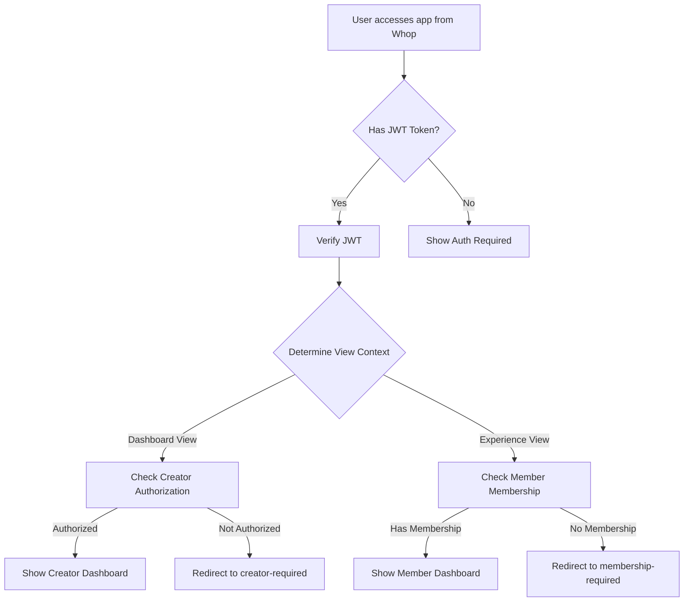

# Whop Authentication & Authorization Guide

## Overview

This document describes the authentication and authorization system for differentiating between Creator and Member dashboards in the Referral Flywheel app. The system uses Whop's native JWT-based authentication to provide secure, role-based access control.

## Key Improvements Over Query Parameters

Previous approach relied on untrusted URL parameters (`?is_owner=true`). The new system:

- ✅ Uses signed JWT tokens from Whop (`x-whop-user-token`)
- ✅ Verifies user identity cryptographically
- ✅ Derives roles from actual Whop relationships (not URL params)
- ✅ Implements proper middleware protection
- ✅ Follows Whop's App View architecture

## Architecture

### 1. Authentication Flow



### 2. View Context Detection

The system automatically detects the context based on the URL path:

- **Dashboard View** (Creator context):
  - `/seller-product/*` - Creator dashboard
  - `/dashboard/*` - Admin dashboard
  - `/admin/*` - Admin pages

- **Experience View** (Member context):
  - `/customer/*` - Member dashboard
  - `/experience/*` - Member experience
  - `/member/*` - Member pages

- **Public View**:
  - `/` - Home page
  - `/discover/*` - Public discovery
  - `/r/*` - Referral links

### 3. File Structure

```
lib/whop/
├── auth.ts           # Core auth utilities and types
├── auth-server.ts    # Server component helpers
└── ...

middleware.ts         # Next.js middleware for route protection

app/
├── auth/
│   ├── creator-required/    # Creator auth error page
│   ├── membership-required/ # Member auth error page
│   └── unauthorized/         # Generic auth error page
├── seller-product/[experienceId]/  # Creator dashboard (protected)
└── customer/[experienceId]/        # Member dashboard (protected)
```

## Implementation Details

### Core Components

#### 1. JWT Verification (`lib/whop/auth.ts`)

```typescript
// Verify Whop JWT token
export async function verifyWhopJWT(token: string): Promise<WhopUserClaims | null>

// Get view context from URL
export function getViewContext(pathname: string): ViewContext

// Extract IDs from path
export function extractIdsFromPath(pathname: string)
```

#### 2. Middleware Protection (`middleware.ts`)

The middleware:
- Intercepts all requests to protected routes
- Checks for `x-whop-user-token` header
- Sets context headers for server components
- Returns appropriate error responses for unauthorized access

#### 3. Server Helpers (`lib/whop/auth-server.ts`)

Server components can use these helpers:

```typescript
// Get auth context in server components
const authContext = await getServerAuthContext();

// Require creator access (redirects if not authorized)
await requireCreatorAccess(companyId);

// Require member access (redirects if no membership)
await requireMemberAccess(companyId, experienceId);

// Get current user ID
const userId = await getCurrentUserId();
```

### Dashboard Integration

#### Creator Dashboard

```typescript
// app/seller-product/[experienceId]/page.tsx
export default async function CreatorDashboardPage({ params }) {
  // Verify creator access
  const authContext = await getServerAuthContext();

  // Development mode bypass
  const isDevelopmentMode = !authContext.isAuthenticated &&
                            process.env.NODE_ENV === 'development';

  // Require authentication in production
  if (!isDevelopmentMode && authContext.viewContext === ViewContext.DASHBOARD) {
    await requireCreatorAccess(params.experienceId);
  }

  // Continue with dashboard logic...
}
```

#### Member Dashboard

```typescript
// app/customer/[experienceId]/page.tsx
export default async function MemberDashboard({ params }) {
  // Verify member access
  const authContext = await getServerAuthContext();

  // Require membership in production
  if (!isDevelopmentMode && authContext.viewContext === ViewContext.EXPERIENCE) {
    await requireMemberAccess(undefined, params.experienceId);
  }

  // Continue with dashboard logic...
}
```

## Security Considerations

### 1. JWT Security

- **TODO**: Implement proper JWT signature verification with Whop's public key
- Currently decoding without verification (development only)
- Checks token expiration if present
- Validates required claims (user_id)

### 2. Development Mode

- Authentication can be bypassed in development (`NODE_ENV=development`)
- Allows testing without Whop integration
- Should NEVER be enabled in production

### 3. Database Lookups

Currently, authorization checks query the local database:
- `isAuthorizedUser()` - Checks Creator table for whopUserId match
- `hasActiveMembership()` - Checks Member table for active membership

**Future Enhancement**: These should call Whop API directly for real-time verification.

## Future Enhancements

### 1. Complete Whop API Integration

```typescript
// Future: Direct Whop API calls
async function isAuthorizedUser(userId: string, companyId: string) {
  const response = await whopAPI.get(`/companies/${companyId}/users/${userId}`);
  return response.role === 'owner' || response.role === 'admin';
}

async function hasActiveMembership(userId: string, companyId: string) {
  const response = await whopAPI.get(`/users/${userId}/memberships`);
  return response.memberships.some(m =>
    m.companyId === companyId &&
    m.status === 'active'
  );
}
```

### 2. Enhanced User Lookup

When authenticated, use whopUserId for database queries:

```typescript
// Enhanced creator lookup
const creator = await prisma.creator.findFirst({
  where: {
    OR: [
      { companyId: experienceId },
      { productId: experienceId },
      { whopUserId: authenticatedUserId } // Use JWT user ID
    ]
  }
});
```

### 3. Whop SDK Integration

Once Whop SDK version conflicts are resolved:

```typescript
import { verifyJWT } from '@whop/api';

// Use official SDK for JWT verification
const claims = await verifyJWT(token, {
  publicKey: process.env.WHOP_PUBLIC_KEY
});
```

### 4. Session Management

Implement session caching to reduce API calls:

```typescript
// Cache auth context in session
const session = await getServerSession();
if (session?.whopUserId) {
  // Use cached session
} else {
  // Verify JWT and create session
}
```

## Testing

### Development Testing

1. **Without Whop Integration**:
   - Set `NODE_ENV=development`
   - Access dashboards directly via URL
   - Authentication will be bypassed

2. **With Whop Proxy**:
   - Use Whop's development proxy
   - Receive real JWT tokens
   - Test full auth flow

### Production Testing

1. Install app in Whop dashboard
2. Access as creator: Dashboard View → `/seller-product/[id]`
3. Access as member: Experience View → `/customer/[id]`
4. Verify appropriate dashboard loads

## Troubleshooting

### Common Issues

1. **"No authentication token"**
   - Ensure accessing app through Whop dashboard
   - Check for `x-whop-user-token` header

2. **"Invalid token"**
   - Token may be expired
   - JWT structure may be invalid

3. **"Not authorized"**
   - User doesn't have creator role for company
   - Database may not have creator record

4. **"No membership"**
   - User doesn't have active membership
   - Database may not have member record

### Debug Checklist

- [ ] Verify JWT token is present in headers
- [ ] Check token expiration
- [ ] Confirm user ID in token claims
- [ ] Verify database has matching records
- [ ] Check middleware is running on route
- [ ] Confirm view context detection is correct

## Migration Notes

### From URL Parameters to JWT Auth

Before:
```typescript
// OLD: Trusting URL parameters
const isOwner = searchParams.is_owner === 'true';
const membershipId = searchParams.membership_id;
```

After:
```typescript
// NEW: Using signed JWT
const authContext = await getServerAuthContext();
const isCreator = await isAuthorizedUser(
  authContext.claims.user_id,
  companyId
);
```

### Database Schema Updates

Consider adding indexes for auth lookups:

```sql
-- Optimize creator lookups
CREATE INDEX idx_creator_whop_user ON "Creator"("whopUserId");
CREATE INDEX idx_creator_company ON "Creator"("whopCompanyId");

-- Optimize member lookups
CREATE INDEX idx_member_whop_user ON "Member"("whopUserId");
CREATE INDEX idx_member_active ON "Member"("isActive");
```

## Summary

This authentication system provides:

- ✅ **Secure** - Cryptographically signed tokens
- ✅ **Native** - Uses Whop's built-in auth
- ✅ **Scalable** - Ready for production use
- ✅ **Maintainable** - Clear separation of concerns
- ✅ **Testable** - Development mode for easy testing

The system ensures that creators only see their dashboards and members only access their referral portals, with proper security and user experience.